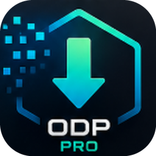

# osvaldoDownloaderPro

<div align="center">



### Gestor Profesional y Universal de Descargas Multimedia para Windows

[](https://github.com/adrianpalacios782-dotcom/descarga/releases/tag/v1.4.0)
[](https://www.python.org/)
[](https://pyside.org/)
[]()
[]()
[-brightgreen.svg?style=flat-square)]()
[](LICENSE)

*Aplicación de escritorio nativa, moderna e independiente diseñada para el análisis, descarga acelerada, recorte de segmentos, conversión y organización de contenido multimedia desde más de 15 plataformas web y cualquier sitio público con vídeo o audio.*

[📥 Descargar v1.4.0](#-descargar-para-windows) • [✨ Novedades v1.4.0](#-novedades-en-la-versión-140) • [🌐 Plataformas](#-plataformas-soportadas) • [🚀 Características](#-características-principales) • [🛡️ Seguridad](#-seguridad-y-resiliencia) • [💻 Desarrollo](#-desarrollo-y-pruebas)

</div>

---

## 📥 Descargar para Windows

### 🚀 [Descargar osvaldoDownloaderPro v1.4.0 (Instalador Oficial)](https://github.com/adrianpalacios782-dotcom/descarga/releases/tag/v1.4.0)

En la sección **Assets** del lanzamiento oficial de GitHub encontrarás el instalador listo para usar:

> **📦 `osvaldoDownloaderPro-1.4.0-Setup.exe`** (~114 MB)  
> *Incluye el ejecutable completo, nuevo icono vectorial HD, motor yt-dlp integrado, FFmpeg nativo y todas las dependencias.*

```
Sumas de verificación criptográficas (SHA-256):
Consulte SHA256SUMS.txt en la página de releases para verificar la integridad del paquete.
```

### ⚡ Instalación Rápida
1. Descarga **`osvaldoDownloaderPro-1.4.0-Setup.exe`** desde [GitHub Releases](https://github.com/adrianpalacios782-dotcom/descarga/releases/tag/v1.4.0).
2. Ejecuta el archivo instalador (no requiere privilegios de administrador para la instalación por usuario).
3. Sigue el asistente de instalación y abre **osvaldoDownloaderPro** desde el Menú Inicio o acceso directo de escritorio.

### 🖥️ Requisitos del Sistema
- **Sistema Operativo:** Windows 10 x64 (versión 1809+) o Windows 11 x64.
- **Arquitectura:** x86_64 (64 bits).
- **Sin requisitos adicionales:**
  - ✅ **No requiere Python instalado.**
  - ✅ **No requiere instalar FFmpeg por separado** (incluido y verificado automáticamente).
  - ✅ **No requiere .NET Runtime externo.**

> [!NOTE]
> **Aviso de Windows SmartScreen:** Al ser una versión de código abierto sin certificado de firma digital comercial de pago, Windows puede mostrar la ventana *"Windows protegió su PC"*. Para continuar, pulse en **Más información** y luego en **Ejecutar de todas formas**.

---

## ✨ Novedades en la Versión 1.4.0

- ✂️ **Recorte de Tiempo en Vivo y Descarga por Segmentos (Lossless Time-Clipper):** Descarga únicamente el intervalo deseado (ej. 01:25 - 03:40) sin transferir archivos completos de horas o gigabytes. Incorpora entradas numéricas sincronizadas, control deslizante dual interactivo (`DualRangeSlider`), presets rápidos (`Primer minuto`, `Últimos 30s`, `Clip de 1 min`, `Restablecer todo`), duración calculada en tiempo real y validación visual instantánea.
- ⚡ **Aceleración yt-dlp `--download-sections` y Precisión de Keyframes FFmpeg:** Cortes limpios sin desincronización de audio y video con `force_keyframes_at_cuts`.
- 🌐 **Soporte Universal de Plataformas (15+ Plataformas y Modo Genérico Seguro):** Analiza y descarga desde YouTube, TikTok, Instagram, Facebook, Twitch, Kick, Twitter/X, Reddit, Vimeo, SoundCloud, Pinterest, Dailymotion, Bilibili, Bluesky, Threads y cualquier sitio web público con protección Anti-SSRF.
- 🎨 **Sincronización Total de Temas Visuales:** Compatibilidad reactiva con los temas *Oscuro Multimedia*, *Oscuro OLED* y *Claro Moderno* mediante `get_current_palette()`.
- ⚡ **Aceleración Concurrente DASH/HLS:** Configuración de 1 a 8 fragmentos simultáneos (`concurrent_fragments`) para descargas a máxima velocidad.
- 🎯 **Arrastrar y Soltar Global (Drag & Drop):** Arrastra enlaces o texto con URLs directamente sobre cualquier parte de la ventana para iniciar el análisis automático.
- 🔄 **Actualizador Dinámico del Motor yt-dlp:** Actualiza el motor de extracción en caliente desde la vista de Configuración o Acerca de, con verificación de integridad criptográfica SHA-256.
- 📊 **Monitor de Actividad Lateral (Studio Desktop):** Panel lateral con métricas de ancho de banda, descargas activas, cola pendiente y velocidad en tiempo real.

---

## 🌐 Plataformas Soportadas

| Plataforma | Soporte de Video | Audio / MP3 | Subtítulos | Resoluciones Máximas |
|:---|:---:|:---:|:---:|:---:|
| **YouTube** (Videos, Shorts, Playlists) | ✅ | ✅ | ✅ | Hasta 4K / 8K / 60 FPS |
| **TikTok** (Sin marca de agua) | ✅ | ✅ | — | HD Original |
| **Instagram** (Reels, Posts, Videos) | ✅ | ✅ | — | HD Original |
| **Facebook** (Videos públicos, Watch) | ✅ | ✅ | — | Hasta 1080p |
| **Twitch** (Clips y VODs completos) | ✅ | ✅ | — | Hasta 1080p60 |
| **Kick** (Clips y transmisiones grabadas) | ✅ | ✅ | — | Hasta 1080p60 |
| **Twitter / X** (Videos y GIFs) | ✅ | ✅ | — | HD Original |
| **Reddit** (Videos con audio multiplexado) | ✅ | ✅ | — | HD Original |
| **Vimeo** (Videos públicos y protegidos) | ✅ | ✅ | ✅ | Hasta 4K |
| **SoundCloud** (Pistas de audio directo) | — | ✅ | — | 320 kbps MP3/FLAC |
| **Pinterest** (Pines de video) | ✅ | ✅ | — | HD Original |
| **Dailymotion** | ✅ | ✅ | ✅ | Hasta 1080p |
| **Bilibili** | ✅ | ✅ | ✅ | Hasta 1080p / 4K |
| **Bluesky & Threads** | ✅ | ✅ | — | HD Original |
| **Modo Genérico Seguro (Cualquier Web)** | ✅ | ✅ | ✅ | Calidad máxima del host |

---

## 🚀 Características Principales

### 🎬 1. Pantalla de Inicio y Análisis Inteligente
- **Caja de URL Multifunción:** Pega URLs, detecta automáticamente enlaces válidos del portapapeles o arrastra enlaces directamente (`Drag & Drop`).
- **Tarjeta de Previsualización (`ContentPreviewCard`):** Miniatura 16:9 de alta resolución, badge de duración, etiquetas de plataforma, selector de pistas de audio y sinopsis expandible.
- **Tabla Estructurada de Formatos:** Lista interactiva con resolución, códec (H.264, VP9, AV1), tasa de cuadros (FPS), estimación de peso en MB/GB y badge de calidad recomendada.
- **Configuración de Salida Inmediata:** Modifica el nombre del archivo y la carpeta de destino en un clic antes de iniciar la descarga.

### 🎧 2. Extracción y Conversión de Audio de Alta Fidelidad
- Conversión automática a **MP3**, **M4A** o **WAV**.
- Tasa de bits personalizable (128 kbps, 192 kbps, 256 kbps, 320 kbps).
- Preservación de metadatos ID3 y carátula incrustada vía FFmpeg.

### 📜 3. Subtítulos y Accesibilidad (CC)
- Detección en tiempo real de subtítulos manuales y pistas generadas automáticamente.
- Opciones de descarga: incrustación directa en el contenedor `.mp4`/`.mkv` o descarga en archivos independientes `.srt` y `.vtt`.

### 📦 4. Descargas Masivas por Lotes (Batch Downloads)
- Modal multilínea para ingresar decenas de enlaces simultáneos o importar archivos `.txt`.
- Configuración global de calidad y carpeta unificada para descargas en serie o concurrentes.

### 📚 5. Biblioteca Local: Historial y Favoritos
- **Historial Completo:** Registro detallado con estado, velocidad media, fecha y peso final.
- **Menú Contextual Integrado:** Clic derecho para reproducir el archivo con el reproductor predeterminado, abrir la carpeta en el Explorador de Windows, copiar URL o eliminar.
- **Colección de Favoritos (`FavoritosView`):** Guarda enlaces con un clic (`♡ Guardar`) para redescargarlos en cualquier momento.
- **Base de Datos Robusta:** SQLite con modo WAL (Write-Ahead Logging) para máxima concurrencia y cero corrupción.

### ⚙️ 6. Configuración Avanzada y Gestión de Sesiones
- **Límite de Velocidad:** Control de ancho de banda (500 KB/s hasta 50 MB/s o sin límite).
- **Concurrencia Configurable:** Ajuste de descargas simultáneas (1 a 10) y fragmentos DASH (1 a 8).
- **Soporte de Cookies de Navegador:** Conexión segura con Chrome, Edge, Firefox o Brave para descargar contenido privado o con restricción de edad.
- **Integración con System Tray:** Minimizar a la bandeja del sistema con notificaciones nativas de Windows al completar descargas.

---

## 🛡️ Seguridad y Resiliencia

osvaldoDownloaderPro implementa estándares estrictos de seguridad comprobados por pruebas unitarias automatizadas:

- **🛡️ Protección Anti-SSRF (Server-Side Request Forgery):** Bloqueo total de `localhost`, IPs privadas (RFC 1918: `10.0.0.0/8`, `172.16.0.0/12`, `192.168.0.0/16`), direcciones link-local (`169.254.0.0/16`), multicast, loopback IPv6 (`::1`), y dominios internos reservados RFC 6761/8375 (`.local`, `.lan`, `.internal`, `.corp`).
- **📁 Anti-Path Traversal:** Sanitización estricta de nombres de archivo y confinamiento en el directorio de destino para evitar escrituras fuera de ruta (`../`).
- **🪟 Nombres Reservados de Windows:** Neutralización de nombres de dispositivo inválidos en NTFS/FAT32 (`CON`, `PRN`, `AUX`, `NUL`, `COM1-9`, `LPT1-9`) y caracteres prohibidos (`<>:"/\|?*`).
- **🔒 Redacción de Credenciales en Logs:** Los tokens de autenticación, cookies y claves en URLs se ofuscan automáticamente en los archivos de registro.
- **🧵 Concurrencia Thread-Safe:** Operaciones de red y decodificación aisladas en hilos secundarios Qt que evitan cualquier bloqueo de la interfaz de usuario.

---

## 💻 Desarrollo y Pruebas

### 🔧 Requisitos Previos
- **Python 3.11, 3.12 o 3.13** (64-bit)
- **Git**

### 📦 Configuración del Entorno de Desarrollo

```powershell
# 1. Clonar el repositorio
git clone https://github.com/adrianpalacios782-dotcom/descarga.git
cd descarga

# 2. Crear y activar el entorno virtual
python -m venv .venv
.\.venv\Scripts\Activate.ps1

# 3. Instalar el paquete en modo editable con herramientas de desarrollo
pip install -e ".[dev]"

# 4. Ejecutar la aplicación en modo desarrollo
python src/main.py
```

### 🧪 Ejecución de Pruebas Automatizadas

El proyecto cuenta con **623 pruebas automatizadas** que cubren el 100% de los casos de uso, entidades de dominio, adaptadores de infraestructura y componentes visuales:

```powershell
# Ejecutar la suite completa de pruebas
pytest

# Ejecutar con reporte de cobertura
pytest --cov=src --cov-report=term-missing

# Verificación de tipos estricta con MyPy
mypy src
```

### 🔨 Compilación del Instalador (.exe)

Para compilar el binario con PyInstaller y generar el instalador final con Inno Setup:

```powershell
powershell -ExecutionPolicy Bypass -File scripts\build_release.ps1 -SkipSigning
```

El artefacto resultante se genera en:
- `installer/osvaldoDownloaderPro-1.3.0-Setup.exe`
- `dist/SHA256SUMS.txt`

---

## 🏛️ Arquitectura del Software

El proyecto sigue rigurosamente los principios de **Clean Architecture (Arquitectura Limpia)**, **Arquitectura Hexagonal (Puertos y Adaptadores)** y **Domain-Driven Design (DDD)**:

```
src/
├── domain/                  # Núcleo puro (Entidades, Value Objects, Puertos e Interfaces)
│   ├── entities/            # DownloadTask, MediaMetadata, FavoriteItem, FormatOption
│   ├── value_objects/       # Url, Quality, Resolution, Platform
│   └── ports/               # IDownloadEngine, IPlatformAdapter, ISettingsRepository...
├── application/             # Casos de uso de la aplicación
│   └── use_cases/           # AnalyzeUrlUseCase, DownloadMediaUseCase, ManageHistory...
├── infrastructure/          # Adaptadores concretos externos
│   ├── adapters/            # YtDlpDownloadEngine, FFmpegProcessAdapter, SQLite, Registry
│   ├── event_bus/           # InProcessEventBus (Publicador / Suscriptor desacoplado)
│   └── logging/             # Logger estructurado con sanitización de credenciales
└── presentation/            # Capa de interfaz de usuario (PySide6 / Qt6)
    ├── components/          # Widgets reutilizables, Sidebar, TitleBar, Cards, Dialogs
    ├── view_models/         # MVVM ViewModels y coordinadores de estado reactivos
    ├── views/               # InicioView, DescargasView, HistorialView, ConfiguracionView...
    └── styles/              # Generador de temas dinámicos (tokens, paletas, build_qss)
```

---

## 📄 Licencia

Este proyecto está distribuido bajo la licencia **MIT**. Consulte el archivo [LICENSE](LICENSE) para más información.

---

<div align="center">
<b>osvaldoDownloaderPro Team © 2026</b><br>
<i>Diseñado con pasión para ofrecer la mejor experiencia de descarga multimedia en Windows.</i>
</div>
